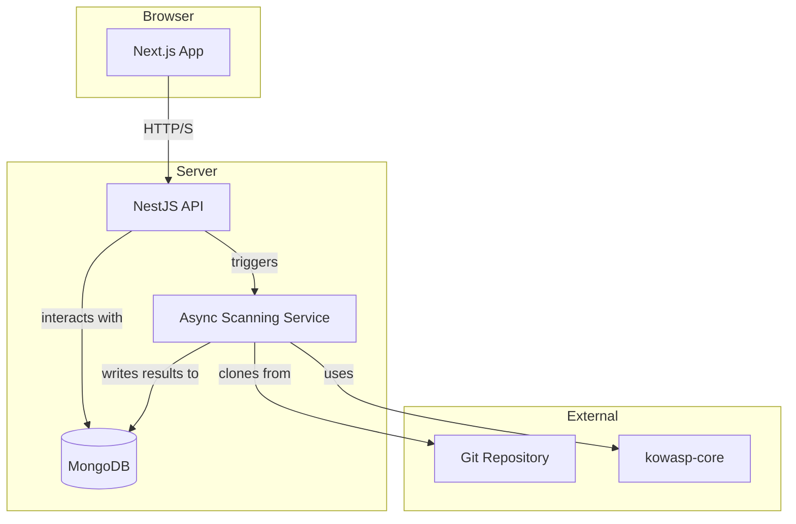

# KOWASP Security Scanner - Technical Specification

## 1. Overview

This document outlines the technical specifications for the KOWASP Security Scanner application. The application provides a web-based interface for scanning Express.js applications for Cross-Site Scripting (XSS) vulnerabilities using the `kowasp-core` engine. It allows users to manage projects, view scan results on a dashboard, and stores all data in a MongoDB database.

**New Features:**
- Users can scan a single file by copy-pasting code into a Monaco Editor in the dashboard.
- Users can upload a zipped directory to scan an entire project without needing a remote repository.

## 2. Actors & Roles

The system defines three user roles with different levels of access and capabilities.

| Role        | Description                                                                                              |
|-------------|----------------------------------------------------------------------------------------------------------|
| **Guest**   | An unauthenticated user. Can view public pages like the landing page, login, and sign up.              |
| **User**    | An authenticated user. Can create and manage their own projects, run scans, and view their results.        |
| **Admin**   | A privileged user. Has all the capabilities of a User, plus access to an admin dashboard to manage users and view all projects and scans across the platform. |

## 3. Use Cases

### 3.1 Guest Use Cases
- Visit the landing page.
- Register for a new account.
- Log in to an existing account.

### 3.2 User Use Cases
- Log out of the application.
- View personal dashboard with a list of projects and recent scan summaries.
- Create a new project by providing a name and a link to a source code repository (e.g., GitHub).
- Scan a single file by pasting code into a Monaco Editor and viewing the results immediately.
- Upload a zipped directory to scan an entire project for vulnerabilities.
- Initiate a security scan for a project.
- View a history of scans for a project, sortable and filterable by date.
- View a detailed report for a specific scan, including vulnerabilities, severity, and remediation advice.
- Delete their own projects.
- Manage account settings (e.g., change password).

### 3.3 Admin Use Cases
- All use cases available to a **User**.
- Access an admin-specific dashboard with platform-wide statistics.
- View a list of all users on the platform.
- View and manage all projects and scan results from any user.
- Delete users from the platform.

## 4. Application Architecture

The application follows a modern web architecture, composed of:

- **Frontend**: A Next.js single-page application providing the user interface.
- **Backend**: A NestJS RESTful API server that handles business logic, user authentication, and database interactions.
- **Database**: A MongoDB instance for data persistence.
- **Scanning Service**: A background worker process that utilizes the `kowasp-core` library to perform asynchronous code analysis.



## 5. Frontend (kowasp-frontend)

- **Framework**: Next.js (App Router)
- **Language**: TypeScript
- **Styling**: Tailwind CSS

### Frontend Routes

| Route                               | Description                                     | Access      |
|-------------------------------------|-------------------------------------------------|-------------|
| `/`                                 | Landing page. Redirects to `/dashboard` if logged in. | Guest, User |
| `/login`                            | User login page.                                | Guest       |
| `/signup`                           | User registration page.                         | Guest       |
| `/dashboard`                        | Main dashboard for the user. Lists projects.    | User        |
| `/dashboard/scan-file`              | Modal or page for scanning a single file using Monaco Editor. | User |
| `/dashboard/upload-directory`       | Modal or page for uploading a zipped directory for scanning. | User |
| `/projects/new`                     | Page with a form to create a new project.       | User        |
| `/projects/[projectId]`             | Project details page. Shows scan history.       | User        |
| `/projects/[projectId]/scans/[scanId]` | Detailed view of a single scan report.         | User        |
| `/settings`                         | User account settings page.                     | User        |
| `/admin/dashboard`                  | Admin dashboard with overview stats.            | Admin       |
| `/admin/users`                      | Page to manage all platform users.              | Admin       |


## 6. Backend (kowasp-backend)

- **Framework**: NestJS
- **Language**: TypeScript
- **Database ORM**: Mongoose

### API Endpoints

All routes are prefixed with `/api`.

#### 6.1 Authentication (`/auth`)
- `POST /auth/signup`: Register a new user.
- `POST /auth/login`: Authenticate a user and return a JWT.
- `GET /auth/me`: Get the profile of the currently authenticated user.

#### 6.2 Projects (`/projects`)
- `POST /`: Create a new project. (Requires authentication)
- `GET /`: List projects for the authenticated user.
- `GET /:projectId`: Get details for a specific project.
- `DELETE /:projectId`: Delete a project.

#### 6.3 Scans (`/scans`)
- `POST /projects/:projectId/scans`: Trigger a new scan for a project.
- `GET /projects/:projectId/scans`: List all scans for a project.
- `GET /:scanId`: Get the detailed report for a specific scan.
- `POST /scans/code`: Scan a single file by sending code in the request body.
- `POST /scans/upload-directory`: Scan an uploaded zipped directory.

#### 6.4 Admin (`/admin`)
- `GET /users`: List all users. (Requires Admin role)
- `GET /projects`: List all projects from all users. (Requires Admin role)
- `GET /scans`: List all scans. (Requires Admin role)
- `DELETE /users/:userId`: Delete a user. (Requires Admin role)

## 7. Database Schema (MongoDB)

### `users` collection
```json
{
  "_id": "ObjectId",
  "email": "String",
  "passwordHash": "String",
  "role": "String", // 'user' or 'admin'
  "createdAt": "Date",
  "updatedAt": "Date"
}
```

### `projects` collection
```json
{
  "_id": "ObjectId",
  "name": "String",
  "repositoryUrl": "String",
  "ownerId": { "type": "ObjectId", "ref": "User" },
  "createdAt": "Date",
  "updatedAt": "Date"
}
```

### `scans` collection
```json
{
  "_id": "ObjectId",
  "projectId": { "type": "ObjectId", "ref": "Project" },
  "status": "String", // 'queued', 'running', 'completed', 'failed'
  "results": { // Based on SecurityReport from implementation-plan.md
    "summary": {
      "totalIssues": "Number",
      "severityBreakdown": "Object",
      "filesAnalyzed": "Number"
    },
    "findings": [
      {
        "static": {
          "rule": "String",
          "severity": "String",
          "location": {
            "file": "String",
            "line": "Number",
            "column": "Number"
          },
          "code": "String",
          "context": "String"
        },
        "llm": {
          "isVulnerable": "Boolean",
          "confidence": "Number",
          "explanation": "String",
          "remediation": "String",
          "codeExample": "String"
        }
      }
    ],
    "recommendations": ["String"]
  },
  "createdAt": "Date",
  "completedAt": "Date"
}
```

## 8. Scanning Process

1.  A user triggers a scan for a project via the frontend, pastes code into the Monaco Editor, or uploads a zipped directory.
2.  The backend API receives the request:
    - For project scans, creates a new `scan` document in the database with `status: 'queued'`, and pushes a job to a message queue (e.g., RabbitMQ or Redis).
    - For single file scans, runs the analyzer immediately and returns results.
    - For uploaded directories, extracts the zip, runs the analyzer, and returns results.
3.  A dedicated **Scanning Service** worker picks up project scan jobs from the queue.
4.  The worker clones the project's git repository to a temporary directory (for repo scans).
5.  It executes the `kowasp-core` analyzer on the source code (repo, file, or uploaded directory).
6.  Upon completion, the worker updates the `scan` document in MongoDB with the results from `kowasp-core` and sets the `status` to `'completed'` or `'failed'` (for project scans), or returns results directly (for file/directory scans).
7.  The frontend can poll the backend for the scan status or receive a real-time update via WebSockets to show the results when ready.

This asynchronous process ensures the API remains responsive and can handle long-running scans without timing out. 