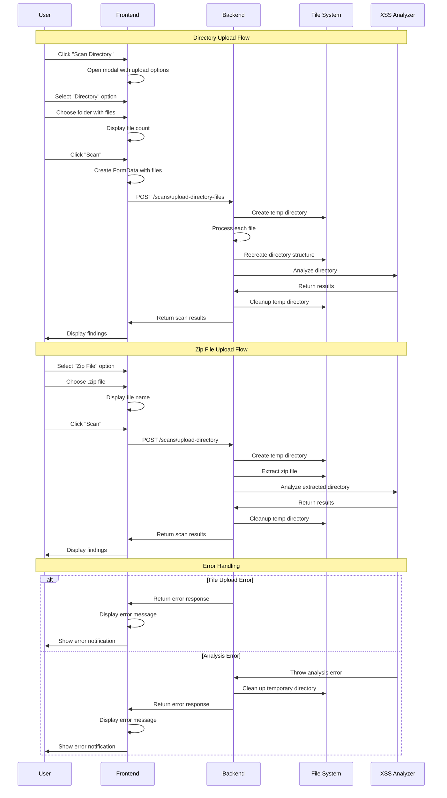

# Upload Directory Feature - Sequence Diagram

This sequence diagram shows the flow for uploading directories to the KOWASP security scanner, with support for both directory upload and zip file upload options.

## Key Components

### Frontend (Next.js)
- **ScanDirectoryModal**: Modal component with upload type selection
- **File Handling**: Processes directory selection and zip file selection
- **FormData Creation**: Prepares files for upload with proper paths
- **Result Display**: Shows scan results in formatted view

### Backend (NestJS)
- **FilesInterceptor**: Handles multiple file uploads for directory
- **FileInterceptor**: Handles single file upload for zip
- **Directory Processing**: Recreates directory structure from uploaded files
- **Zip Processing**: Extracts zip files and finds root directory
- **Analysis Integration**: Calls kowasp-core XSSAnalyzer
- **Result Transformation**: Converts analyzer results to frontend format

### File System Operations
- **Temporary Directory Creation**: Creates unique temp directories
- **Directory Structure Recreation**: Maintains original file paths
- **File Writing**: Writes uploaded files to correct locations
- **Cleanup**: Removes temporary directories after analysis

### XSS Analyzer (kowasp-core)
- **Directory Scanning**: Analyzes all files in uploaded directory
- **Vulnerability Detection**: Identifies XSS vulnerabilities
- **Result Generation**: Returns structured analysis results

## Upload Options

### Directory Upload
1. User selects "Directory" option
2. File picker opens with directory selection enabled
3. User selects a folder containing files
4. All files and subdirectories are uploaded with preserved structure
5. Backend recreates the exact directory structure
6. Analysis runs on the complete directory

### Zip File Upload
1. User selects "Zip File" option
2. File picker opens with .zip file filter
3. User selects a compressed directory
4. Backend extracts the zip file
5. Analysis runs on the extracted contents
6. Maintains backward compatibility with existing functionality

## Error Handling

- **File Upload Errors**: Network issues, file size limits, invalid file types
- **Directory Processing Errors**: Missing paths, permission issues
- **Analysis Errors**: Invalid code, analyzer failures
- **Cleanup Errors**: Temporary directory removal failures

All errors are properly handled and displayed to the user with meaningful messages. 